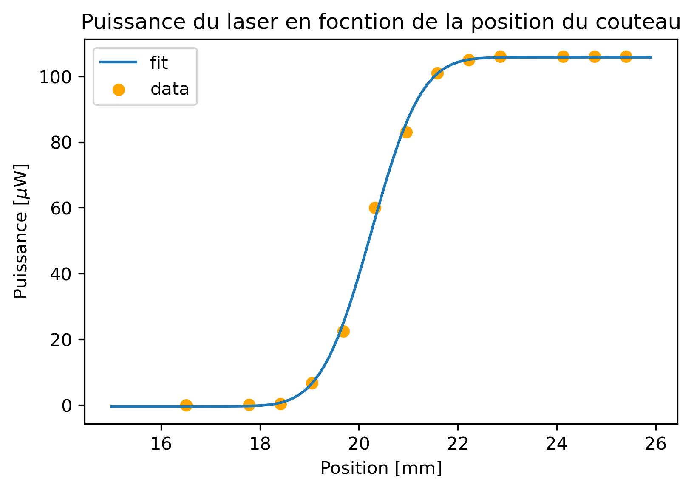
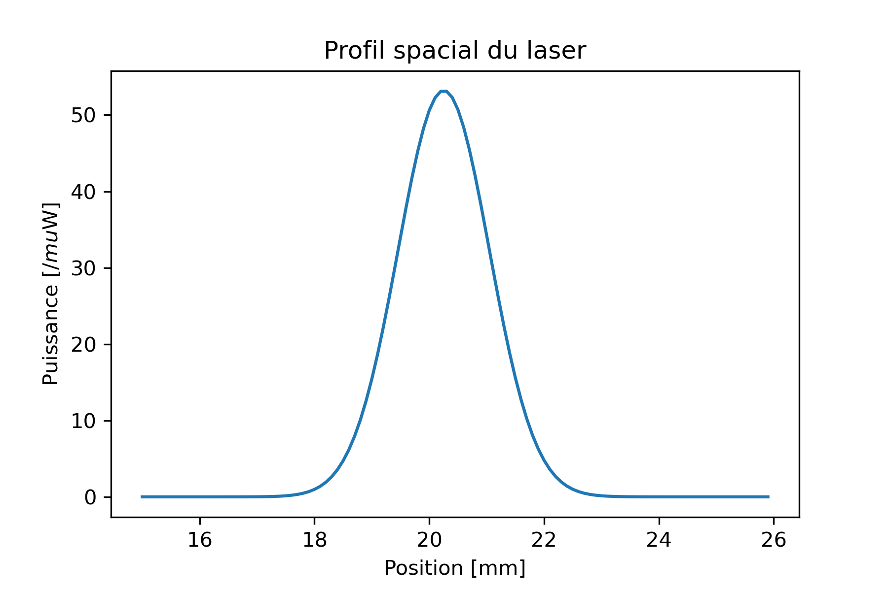

# Knife-edge-measurement
Traitement des données pour la mesure de la largeur d'un faisceau gaussien. La méthode du couteau a été utiliée pour faire la mesure[1]. Le script ajuste une fonction *erf* grâce aux données. Puis en dérivant la courbe obtenue, on peut déterminer la largeur du faisceau gaussien.

---
[1]https://people.fjfi.cvut.cz/blazejos/public/ul7en.pdf
